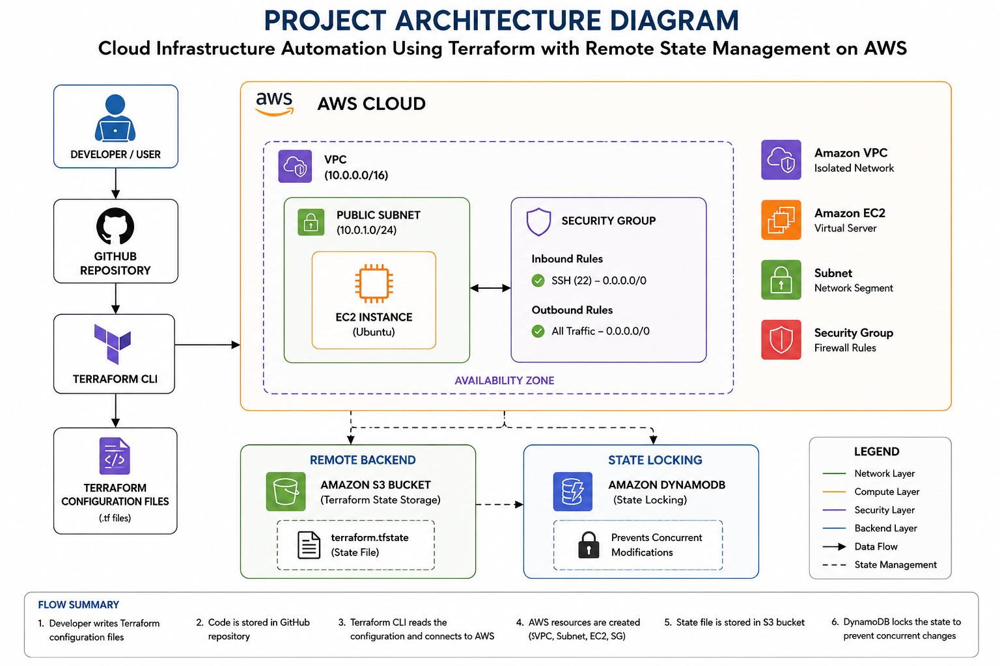
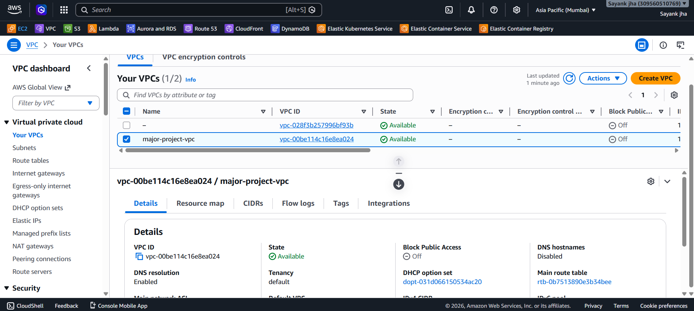
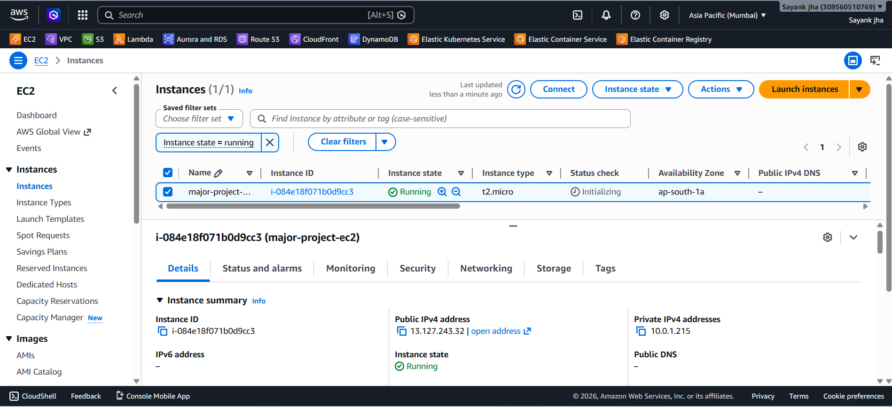
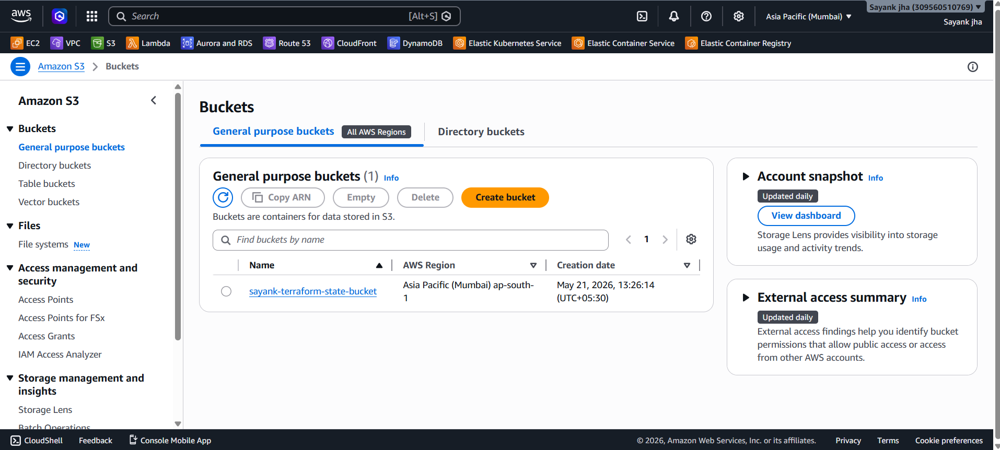
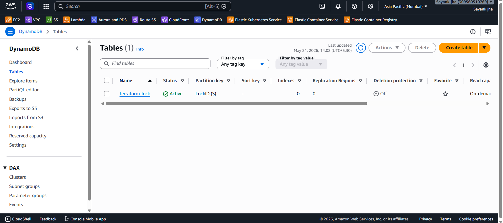

# Cloud Infrastructure Automation Using Terraform with Remote State Management on AWS

## Project Overview
This project demonstrates automated cloud infrastructure provisioning on AWS using Terraform. The project implements Infrastructure as Code (IaC) concepts with modular architecture, remote backend configuration, and state locking mechanisms.

## Objectives
- Automate AWS infrastructure provisioning
- Implement Infrastructure as Code using Terraform
- Configure remote state management using AWS S3
- Implement state locking using DynamoDB
- Create reusable Terraform modules
- Improve infrastructure consistency and automation

## Features
- Automated EC2 instance provisioning
- Custom VPC creation
- Security Group configuration
- Remote Terraform state management
- DynamoDB state locking
- Modular Terraform architecture
- AWS cloud automation

## Technologies Used
- Terraform
- AWS EC2
- AWS VPC
- AWS S3
- AWS DynamoDB
- GitHub
- VS Code

## AWS Services Used
| Service | Purpose |
|---|---|
| EC2 | Virtual Server |
| S3 | Terraform Remote Backend |
| DynamoDB | State Locking |
| VPC | Network Isolation |
| Security Group | Firewall Rules |

## Project Architecture
Developer → Terraform → AWS Infrastructure

Infrastructure Components:
- VPC
- Subnet
- EC2
- Security Group
- S3 Backend
- DynamoDB Locking

## Terraform Commands Used

### Initialize Terraform
terraform init

### Validate Configuration
terraform validate

### Preview Changes
terraform plan

### Apply Infrastructure
terraform apply

### Destroy Infrastructure
terraform destroy

## Advantages
- Faster infrastructure provisioning
- Infrastructure consistency
- Reusable code
- Better collaboration
- Automated deployment
- Reduced manual configuration

## Future Scope
- Jenkins CI/CD integration
- Kubernetes deployment
- Monitoring using Prometheus & Grafana
- Multi-environment deployment
- Auto Scaling implementation

## Conclusion
This project successfully demonstrates cloud infrastructure automation using Terraform on AWS with secure remote state management and state locking mechanisms.

## Author
Sayank Jha
MCA Major Project

## Project Screenshots

## Architecture Diagram

### AWS VPC

### AWS EC2 Instance

### S3 Backend

### DynamoDB Locking

